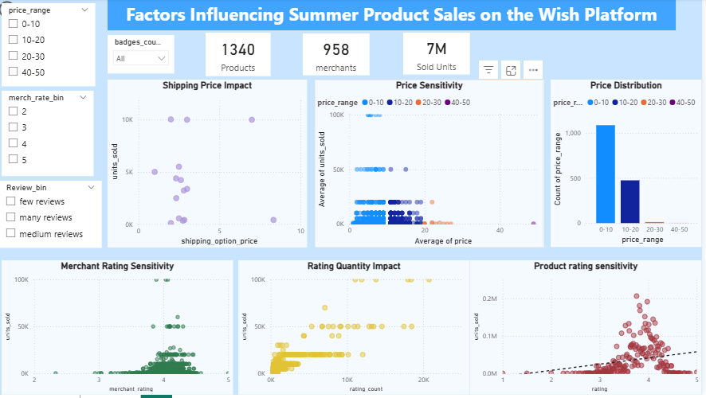
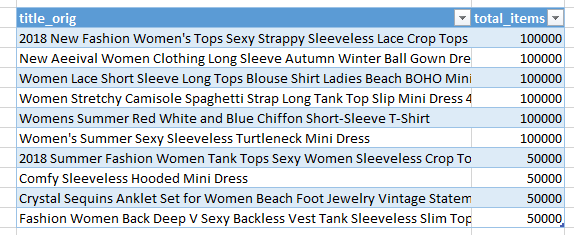
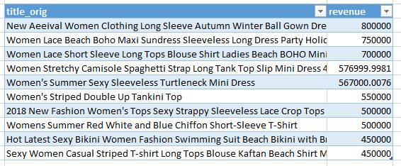
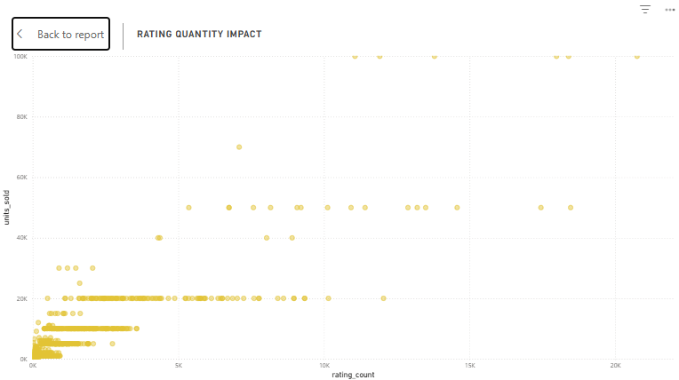
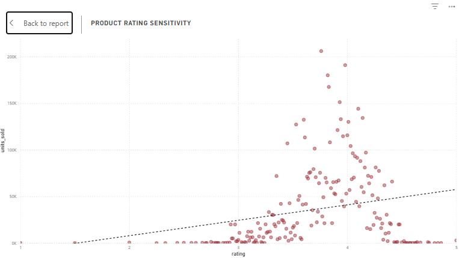
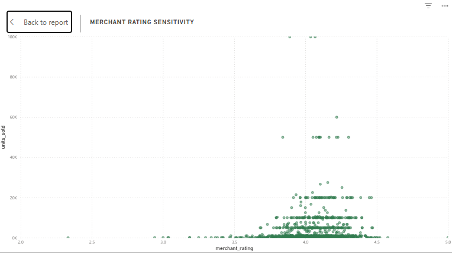
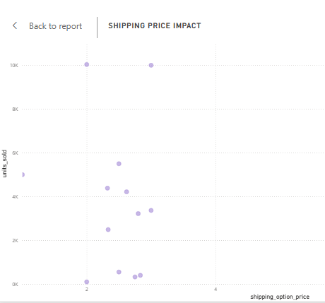
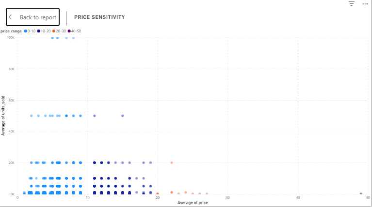
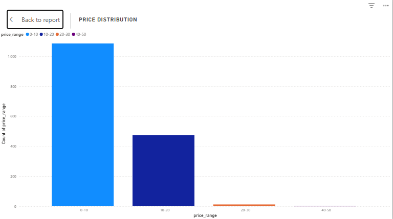

# Wish E-commerce Success Factors Analysis

End-to-end data analytics capstone project exploring key drivers of product performance in an e-commerce environment using Python, SQL, and Power BI.

---

## Project Objective

The goal of this project was to analyze factors influencing product sales performance and demonstrate a complete analytics workflow including:

- Data cleaning & exploration
- Analytical querying
- Data transformation
- Data modeling
- Dashboard development
- Business insight generation

---


##  Dashboard Overview

Below is the complete interactive Power BI dashboard designed to analyze the e-commerce performance drivers:



---

## Tools & Technologies

- Python
- SQL
- Power BI
- Star Schema Modeling

---

## Workflow

### Python
- Data cleaning
- Missing value handling
- Exploratory analysis

### SQL
- Revenue analysis
- Product segmentation
- Ratings & review analysis
- Merchant performance analysis

### Power BI
- Data transformation
- Star schema creation
- Dashboard development
- KPI visualization

---

## Repository Structure

```text
python/     -> Python notebooks
sql/        -> SQL analytical queries
powerbi/    -> Power BI dashboard files
visuals/    -> Dashboard screenshots
```

---

## Key Business Questions

- Which products generate the highest revenue?
- How do ratings influence sales?
- Does shipping price affect sales performance?
- How does merchant reputation impact sales?
- Which price ranges perform best?

---

## Key Insights & Recommendations

### Top Performing Products
**Insight:** Women's products consistently ranked among the highest-performing products by both revenue and units sold.

**Recommendation:** Increase marketing focus and promotional visibility for high-performing women's product categories.





---

### Customer Reviews & Sales Performance
**Insight:** Products with higher review counts showed significantly stronger sales performance, highlighting the importance of social proof in e-commerce purchasing decisions.

**Recommendation:** Encourage customers to leave reviews through post-purchase incentives such as loyalty points or discount offers.



---

### Product Ratings & Consumer Trust
**Insight:** Products rated above 4.0 stars demonstrated stronger sales performance compared to lower-rated products.

**Recommendation:** Prioritize high-rated products in search visibility and recommendation systems.



---

### Merchant Reputation
**Insight:** Higher merchant ratings were strongly associated with increased sales, indicating that customers value seller reliability and trust.

**Recommendation:** Introduce marketplace incentives or badges for top-rated merchants.



---

### Shipping Price Impact
**Insight:** Shipping price showed only a weak relationship with sales volume, suggesting that small shipping cost differences do not strongly influence purchasing behavior.

**Recommendation:** Focus marketing efforts on bundled shipping incentives and free shipping thresholds.



---

### Price Range Distribution
**Insight:** Most sales occurred within the \$0–\$10 price range, though this may partially reflect the platform's heavy concentration of low-priced listings.

**Recommendation:** Expand product variety within the \$10–\$20 segment to improve average order value while maintaining affordability.





---

## Project Limitations

- The dataset did not include historical time variables, limiting trend and sales velocity analysis.
- Cost and profitability metrics were unavailable, restricting analysis to revenue and sales volume only.

---


## Dataset

Publicly available e-commerce dataset used for educational and portfolio purposes.
